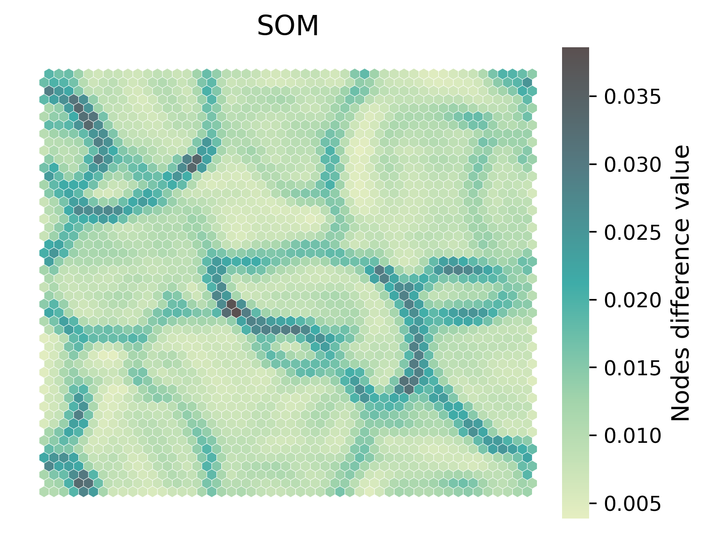

# SimpSOM (Simple Self-Organizing Maps)

## Version 3.0.0

Simple Self-Organizing Maps (SimpSOM) is a lightweight Python 3 library to train SOM. 
It offers an efficient way of training SOM in Python 
while keeping its implementation simple and easy to read.

Version 3 is a rewriting focusing on performance.

## Installation

`simpsom` can be downloaded from PyPI with 

    pip install simpsom

To install the latest (unreleased) version you can download it from this repository by running 
 
    git clone https://github.com/fcomitani/simpsom
    cd simpsom
    python setup.py install

## Dependencies

Core dependencies:

   - numpy
   - scikit-learn
   - matplotlib

If available, `CuPy` can be used to run `simpsom` on the GPU.
`CuML` is also optional, but will allow you 
to run clustering on the GPU as well.

For a full list see `requirements.txt`

## Example of Usage

Running `simpsom` is easy. After setting up a network by providing size and tiling style,
train it with the `train` method. 

    import simpsom as sps

    net = sps.SOMNet(20, 20, data, topology='hexagonal', 
                    init='PCA', metric='cosine',
                    neighborhood_fun='gaussian', PBC=True,
                    random_seed=32, GPU=False, CUML=False,
                    output_path="./")

    net.train(train_algo='batch', start_learning_rate=0.01, epochs=-1, 
        batch_size=-1)

The trained map can be saved to disk.

    net.save_map("./trained_som.npy")

The results can be inspected with a variety of plotting functions.

    net.plot_map_by_difference(show=True, print_out=True)
    net.plot_projected_points(projected_data, color_val=[n.difference for n in net.nodes_list],
            project=False, jitter=False, 
            show=True, print_out=False)

   

Detailed documentation, API references and tutorials can be found [here](https://simpsom.readthedocs.io/en/latest/).
    
## Who is using SimpSOM

Here are some of the research works that use SimpSOM:

> Postema, J. T. (2019). Explaining system behaviour in radar systems (Master's thesis, University of Twente).

> Lorenzi, C., Barriere, S., Villemin, J. P., Dejardin Bretones, L., Mancheron, A., & Ritchie, W. (2020). iMOKA: k-mer based software to analyze large collections of sequencing data. Genome biology, 21(1), 1-19.

> Saunders, J. K., McIlvin, M. R., Dupont, C. L., Kaul, D., Moran, D. M., Horner, T., ... & Saito, M. A. (2022). Microbial functional diversity across biogeochemical provinces in the central Pacific Ocean. Proceedings of the National Academy of Sciences, 119(37), e2200014119.

## Contributions

Contributions are always welcome. If you would like to help us improve this library please fork the main branch and make sure pytest pass after your changes.

## Citation
<!-- To update with JOSS -->

When using this library for your work, please cite the appropriate version from [Zenodo](https://zenodo.org/badge/latestdoi/91130860)

> Federico Comitani. (2022). SimpSOM (v2.0.2). Zenodo. https://zenodo.org/record/7187332

