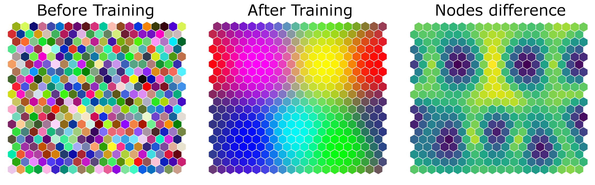
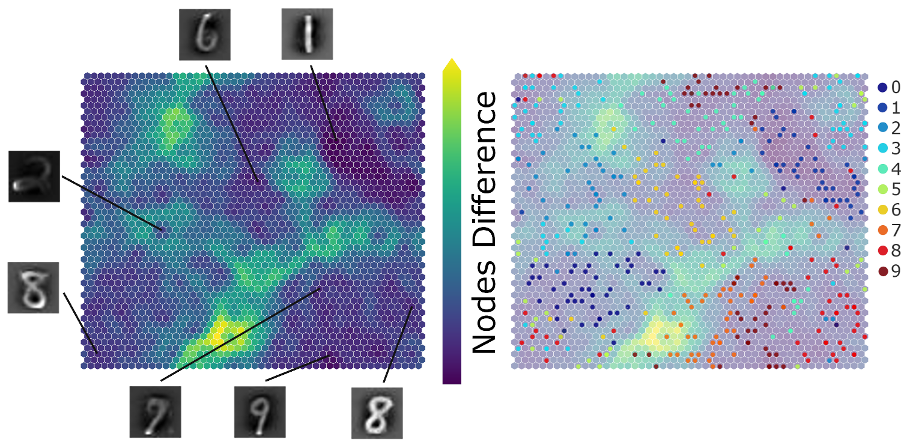

# SimpSOM (Simple Self-Organizing Maps)

[](https://zenodo.org/badge/latestdoi/91130860)
[](https://badge.fury.io/py/simpsom)
[](https://travis-ci.org/fcomitani/simpsom)
[](https://simpsom.readthedocs.io/en/latest/?badge=latest)

The version contained in this branch is currently under development.
Please use the main branch if you are looking for a stable version (1.3.4).

## Version 2.0.0

SimpSOM is a lightweight implementation of Kohonen Self-Organizing Maps
(SOM) for Python 3, useful for unsupervised learning,
clustering and dimensionality reduction.

The package is now available on PyPI, to retrieve it just type
`pip install SimpSOM` or download it from here and install with
`python setup.py install`.

It allows you to build and train SOM on your dataset, save/load the trained
network weights, and display or print graphs of the network with
selected features. The function `run_colors_example()` will run a toy
model, where a number of colors will be mapped from the 3D RGB space to
the 2D network map and clustered according to their similarity in the
origin space.



## What\'s New

- Class and function names have been updated to adhere to PEP8.
- Batch training has been added and is now the default algorithm.
- A light parallelization is now possible with RAPIDS.

## Version compatibility

This version introduces a number of changes, while attempting to maintain
the original philosophy of this project: a SOM library easy to understand and customize.
Functions and classes names have been changed to improve readability.
If you are migrating from an older version (<=1.3.4), please make sure to check the API first!

## Dependencies

```
-   Numpy		== 1.19.5 
-   Matplotlib	== 3.3.3 
-   Sklearn		== 0.22.2.post1 
```

Older/newer versons may work, but make sure to test the library


## Example of Usage

Here is a quick example on how to use the library with an exemplary `raw_data`
dataset:

    import simpsom as sps

Build a network 20x20 with a weights format taken from the raw_data and activate Periodic Boundary Conditions. 
The weights will be initialized at `'random'` rather than with `'PCA'` and you can fix the random number
generator seed for reproducibility with `'random_seed'`.

    net = sps.SOMNet(20, 20, raw_data, PBC=True, init='random', random_seed=8)

By default the network will be trained with the batch training algorithm and 10xsamples number of epochs.
No learning rate is needed.

    net.train()

Alternatively, all of these options can be set mantually. 
For example to train the network with online training (much slower!)
for 1000 epochs and with in nitial learning rate of 0.01, and using 
cosine as a distance metric, use this instead:
   
    net.train(train_algo='online', learning_rate=0.01, metric='cosine', epochs=1000)

Early stopping is also available, for the moment only a couple of rough convergence metrics are available, but more will be added in the future. For example, to check the convergence of the distance between data points and their bmus you can add `early_stop='bmudiff'`. The patience and tolerance can also be set.     

    net.train(epochs=100, early_stop='bmudiff', 
          early_stop_patience=3, early_stop_tolerance=5e-4)

The convergence trend can be plotted with
    
    net.plot_convergence()
    
If you are encountering memory issues when running batch training, you can select the size of the mini batches
with `batch_size`. This won't affect the final result, since the full dataset will still used for the weights' update.

Save the weights to file in the `out_path` directory. This flag can be provided to any other plotting function to save the plots as png files.

    net.save('filename_weights', out_path='./')

Information on each node is stored in the .nodeList attribute of the network. These include each node position in the hexagonal grid (`.pos`) or its weights (`.weights`), i.e. the position of the node in the features space.
    
    position_node0 = net.node_list[0].pos
    weights_node0 = net.node_list_[0].weights 

You can print the hexagonal network nodes and color them according to the any feature (here the feature at position 0) and according to the distance between each node and its neighbours. 
You can also project the data points on the new 2D network map.
    
    net.nodes_graph(colnum=0, out_path=out_path)
    net.diff_graph(out_path=out_path)
    net.project(raw_data, labels=labels, out_path=out_path)

Finally, you can cluster the with a number of different methods.
It's important to note that only Quality Threshold (`'qthresh'`) and Density Peak (`'dpeak'`) are natively implemented and compatible with periodic boundary conditions. Deactivate PBC if you intend to use `'MeanShift'`, `'DBSCAN'`, `'KMeans'`, or your own clustering tool.
    
    net.cluster(raw_data, clus_type='qthresh')	
    
 ## Running on GPU
 
 If you have a CUDA compatible system, you can run this library on GPU just by activating the
 namesake flag when instatiating the SOMNet class.
 
 	net = sps.SOMNet(20, 20, raw_data, PBC=False, GPU=True)
	
To be able to run this option you will need the following RAPIDS libraries:

```
- cupy == 8.60
- cuml == 0.18
```

Please note that newer versions may work, but these libraries are still in development and API breaking
changes are to be expected, make sure to check the RAPIDS repositories for more information.
These libraries do not need to be installed to run the CPU version of SimpSOM.
	
## A More Interesting Example: MNIST

Here is another example of SimpSOM capabilities: the library was used to try and reduce a MNIST handwritten digits dataset. A 50x50 nodes map was trained with 500 MINST landmark data points and 100000 epochs in total, starting from a 0.1 learning rate and without PCA Initialization.



Projecting a few of those points on the map gives the following result, showing a clear distinction between clusters of digits with a few exceptions. Similar shapes (such as 7 and 9) are mapped closed together, while relatively far from other more distinct digits. The accuracy of this mapping could be further improved by tweaking the map parameters and training.
	
## Documentation

See [here](https://simpsom.readthedocs.io/en/master/) the full API documentation

## Citation

If using this library, please cite it as

> Federico Comitani, 2019. fcomitani/SimpSOM: v1.3.4. doi:10.5281/zenodo.2621560

