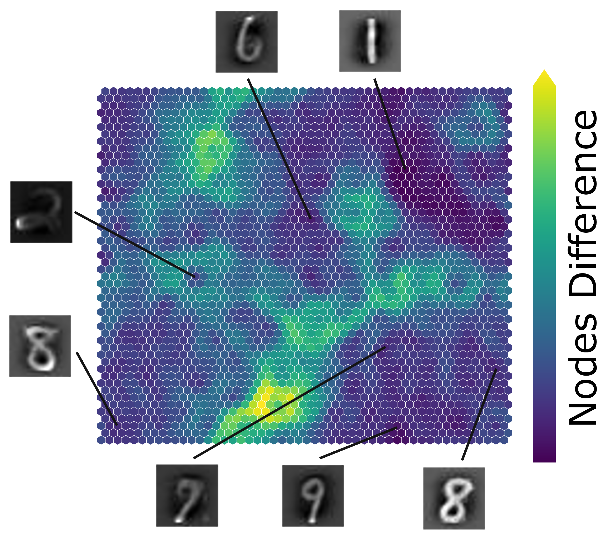

# SimpSOM (Simple Self-Organizing Maps)

## Version 1.3.4

SimpSOM is a lightweight implementation of Kohonen Self-Organising Maps
(SOM) for Python 2.7 and 3, useful for unsupervised learning,
clustering and dimensionality reduction.

The package is now available on PyPI, to retrieve it just type
`pip install SimpSOM` or download it from here and install with
`python setup.py install`.

It allows to build and train SOM on your dataset, save/load the trained
network weights, and display or print graphs of the network with
selected features. The function `run_colorsExample()` will run a toy
model, where a number of colors will be mapped from the 3D RGB space to
the 2D network map and clustered according to their similarity in the
origin space.

## Dependencies

-   Numpy 1.11.0 (older versions may work);
-   Matplotlib 1.5.1 (older versions may work);
-   Sklearn 0.15 (older versions may work);

## Example of Usage

Here is a quick example on how to use the library with a `raw_data`
dataset:

    #Import the library
    import SimpSOM as sps

    #Build a network 20x20 with a weights format taken from the raw_data and activate Periodic Boundary Conditions. 
    net = sps.somNet(20, 20, raw_data, PBC=True)

    #Train the network for 10000 epochs and with initial learning rate of 0.01. 
    net.train(0.01, 10000)

    #Save the weights to file
    net.save('filename_weights')

    #Print a map of the network nodes and colour them according to the first feature (column number 0) of the dataset
    #and then according to the distance between each node and its neighbours.
    net.nodes_graph(colnum=0)
    net.diff_graph()

    #Project the datapoints on the new 2D network map.
    net.project(raw_data, labels=labels)

    #Cluster the datapoints according to the Quality Threshold algorithm.
    net.cluster(raw_data, type='qthresh')	
	
## A More Interesting Example: MNIST

Here is another example of SimpSOM capabilites: the library was used to try and reduce a MNIST handwritten digits dataset. A 50x50 nodes map was trained with 500 MINST landmark datapoints and 100000 epochs in total, starting from a 0.1 learning rate and without PCA Initialisation.

Projecting a few of those points on the map gives the following result, showing a clear distinction between cluster of digits with a few exceptions. Similar shapes (such as 7 and 9) are mapped closed together, while relatively far from other more distinct digits. The accuracy of this mapping could be further improved by tweaking the map parameters, by training the network for more epochs or with a more adequate choice of initial dataset. 	
	
## What\'s New

-   It is now possible to activate periodic boundary conditions, but
    only Quality Threshold and Density Peak clustering can be used with
    PBC;
-   Fixed the random selection of weights, the random vectors now span
    the space of the data;
-   Implemented PCA initialisations (activate with PCI=1);
-   KMeans clustering is now available under the command \'kmeans\';
-   If the number of epochs for the training is not explicitly stated,
    automatically choose 10\*number of datapoints.

	

