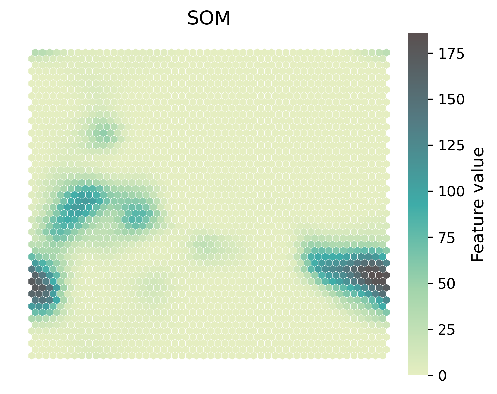
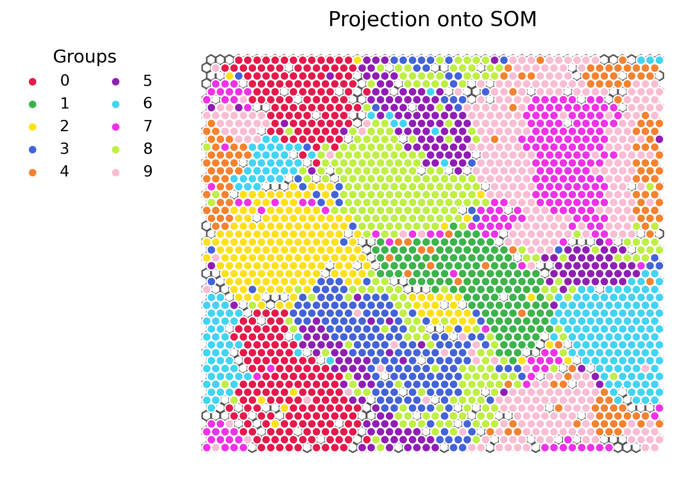
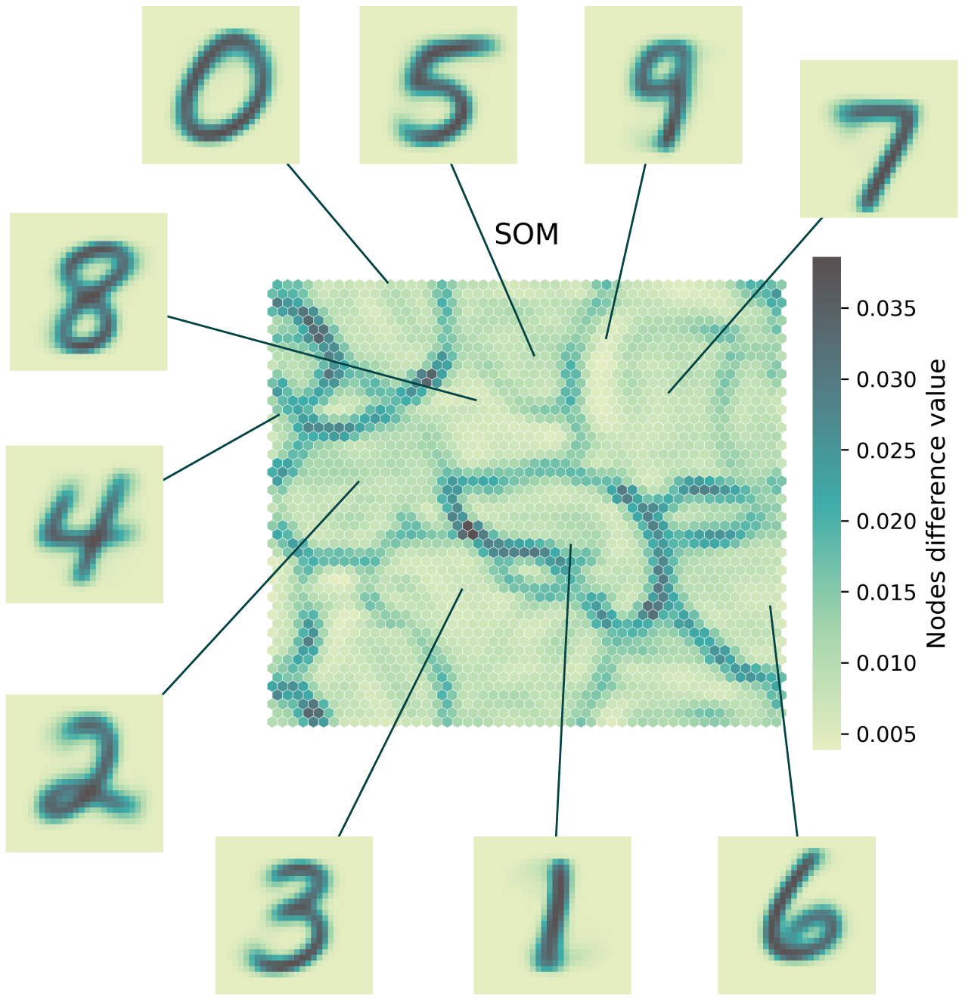

.. _tutorial:

========================
A simple tutorial: MNIST
========================

In this brief tutorial, we will go through the steps required to train a SOM
on MNIST handwritten digits data. 

We start by importing some essential libraries.

.. code-block:: python

    import numpy as np
    import simpsom as sps

    from pylettes import *
    pylette = Tundra(reverse=True).cmap

You can easily load MNIST data from `keras`.

.. code-block:: python

    from keras.datasets import mnist
    (train_X, train_y), (test_X, test_y) = mnist.load_data()

First, we need to reformat the input by flattening the matrix to a monodimensional vector. 
We then set up the map, we will use a 50x50 hexagonal grid with PBC. The nodes will be initialized
from the principal components space, the neighborhood function is set to Gaussian and
we will use cosine as distance metric in the high-dimensional space.

.. code-block:: python

    flat_data = train_X.reshape(train_X.shape[0], -1)

    net = sps.SOMNet(50, 50, flat_data, topology='hexagonal', 
                    PBC=True, init='PCA', metric='cosine', 
                    neighborhood_fun='gaussian',
                    random_seed=32, GPU=False)

We are now ready to train the map. We will use the batch algorithm and save the map to disk once trained.

.. code-block:: python

    net.train(train_algo='batch', start_learning_rate=0.01, 
              epochs=-1, batch_size=-1)
    net.save_map("./trained_som_MNIST.npy")

Let's have a look at the trained map. First by looking at the weights difference.

.. code-block:: python

    _ = net.plot_map_by_difference(show=True, print_out=True, 
        cmap=pylette)        
        
.. image:: ./figs/som_difference.png
  :width: 400
  :alt: SOM map colored by difference.

We can see the decision boundaries (in dark) that separate areas with nodes that share
similar weights. We can expect digits with similar shapes to be found within these basins.

.. code-block:: python

    _ = net.plot_map_by_feature(feature=100, show=True, print_out=True, 
        cmap=pylette)

We can also inspect the values assumed by weights for specific features.
In this case, we can see how nodes in the basin to the bottom right (and bottom left by PBC)
is characterized by high values of the 100th feature. In this case,
images mapping to that area will have color in their 100th pixel.

We can project the digits onto the trained map and see how they are distributed.
We will only train 1000 points per digit.

.. code-block:: python

    from simpsom.plots import scatter_on_map
    
    projection = net.project_onto_map(flat_data)

    scatter_on_map([projection[train_y==i][:1000] for i in range(10)], 
                   [[node.pos[0], node.pos[1]] for node in net.nodes_list],
                   net.polygons, color_val=None,
                   show=True, print_out=True, cmap=pylette)

We see how the different digits are for the most part well compartmentalized. 

We could also have a look at the closest matching unit to the average digit
for each of these groups and see that indeed they fall into the expected basins
and their shapes are a well-representative averages.

.. code-block:: python

    mean_bmus = [net.find_bmu_ix([train_X.reshape(train_X.shape[0], -1)
                 [train_y==i].mean(axis=0)]) for i in range(10)]

    for mb in mean_bmus:
        net.plot_projected_points([net.nodes_list[mb[0]].pos], 
            project=False)
        plt.show()

        plt.imshow(net.nodes_list[mb[0]].weights.reshape(28, 28), 
            cmap=pylette)
        plt.axis('off')
        plt.show()

Putting it all together.

