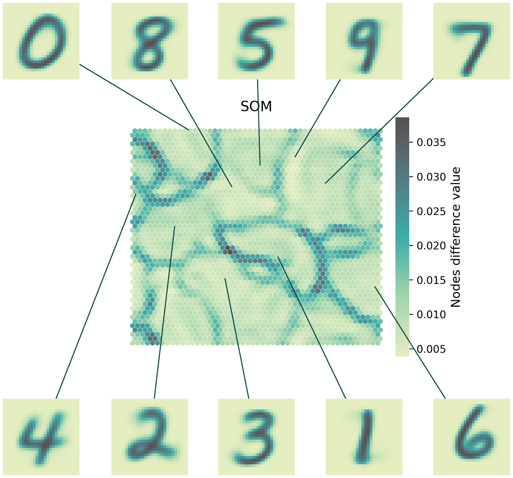

# Summary

Simple Self-Organizing Maps (SimpSOM) is a lightweight library for Kohonen self-organizing maps natively implemented in Python. 
It aims at providing researchers with a set of easy-to-use functionalities for training SOM maps and running inference, while also maintaining the readability of the code. It is customizable with square and hexagonal topologies, optional periodic boundary conditions, a set of distance metrics and neighbouring functions. It is also GPU-compatible to boost training performance.

Initially conceived in 1985, Self-organizing maps are low-dimensionality, ordered grids of nodes or trainable vectors descriptive of a high-dimensionality distribution. They are effectively a similarity graph, which attempts to abstract complex non-linear relationships between data points from their original space and project them onto a low-dimensionality, yet meaningful display. The map is trained by fitting the discrete, ordered vectors of the grid to the input distribution and enforcing regularity and local continuity through neighborhood functions. Once trained, these maps are versatile, their applications range from visualization to clustering and classification [@kohonen2012].

With this library, we aim at offering the scientific community an efficient yet easy-to-use implementation of SOM.

# Statement of Need

There are currently several libraries offering self-organizing maps in Python. Although some are excellent implementations, we argue SimpSOM offers the most complete one. 
kohonen is one of the earliest scripts made available for Python and offers a trainable square grid of nodes [@kohonen2009github], together with other, less common vector quantizers approaches. SOMPY is inspired by an earlier implementation in Matlab and also works with a square topology only, but includes batch training [@moosavi2014]. An early Tensorflow-based implementation of SOM is instead included in NeuPy [@neupy]. minisom is one of the most popular and complete packages but has no periodic boundary conditions [@vettigli2018] and neither does GEMA, the most recent among this list, which however only works with a square topology [@garciatejodor2021]. Finally, som includes PBC but again only works with square tiling [@som].

The first implementation of SimpSOM aimed at allowing streamlined pipelines for building SOM, with an object-oriented syntax for ease of reading and customization. It also offered a high-level interface with out-of-the-box functions for plotting and visualizing the trained map.
As of the last version, v.3.0.0, the focus was improving performance while maintaining readability as the core principle. The computational cost of building and training a map with SimpSOM is now comparable to the best alternative in literature. As part of this effort, SimpSOM is now GPU-enabled with `CuPy` and `CuML, 
CUDA toolkits [@cupy_learningsys2017][@raschka2020machine] for GPU-accelerated computing. 
<!-- figure efficiency -->

Maps can be trained either with the online or the batch algorithm, isolated or within periodic boundary conditions to avoid artifacts at the border. Two separate tiling styles are available, square (4 cardinal + 4 diagonal neighbours) and hexagonal (6 neighbours). Gaussian, bubble and mexican hat can be selected as neighbourhood functions. Euclidean, manhattan and cosine can be set as distance metrics for training, but we envisage the possibility to extend this list in the future and possibly allow custom functions from the user. 
<!-- PBC and GPU major points -->

Plotting functions for visualizing the map, nodes feature values and the local nodes' average difference (U-matrix) are available to the user, and so are a set of tools to project points onto the map at inference and visualize their arrangement.
A wrapper for clustering projected points is also available, with this, a custom clustering algorithm can be provided, as long as they are defined in a scikit-learn-compatible format [@scikit]. Custom metrics for clustering can also be set by the user and are recommended when PBC are active. 

Supporting its ease of use and flexibility, SimpSOM has minimal dependencies, including NumPy and scikit-learn for core calculations and Matplotlib for plotting.

Code from SimpSOM has been used in research works, from outlier detection in signals from radar systems [@postema2019], in genomics [@lorenzi2020] and, more recently, to study microbial diversity in oceans [@saunders2022]. This underlines its potential and utility to the scientific community. 

# How to Use

Training a map and extracting results with SimpSOM is straightforward.
In this brief example, we show how on the popular benchmark MNIST [@deng2012mnist] handwritten digits data set. 

We start by importing the `simpsom`. We then load and reformat the input data into a flat array.

.. code-block:: python

    import simpsom as sps

    from keras.datasets import mnist
    (train_X, train_y), (test_X, test_y) = mnist.load_data()
    flat_data = train_X.reshape(train_X.shape[0], -1)

To set up the map, we instantiate a `SOMNet` object and provide essential information on the type of map we want to train.
Here we choose a 50x50 hexagonal grid with PBC. The nodes will be initialized
from the principal components space, the neighborhood function is set to Gaussian and cosine is set as the distance metric 
in the high-dimensional space.

.. code-block:: python

    net = sps.SOMNet(50, 50, flat_data, topology='hexagonal', 
                     PBC=True, init='PCA', metric='cosine', 
                     neighborhood_fun='gaussian',
                     random_seed=32, GPU=False)

We will train the map with the batch algorithm and save it to disk.
Epochs, batch_size, and learning rate can all be customized, but we recommend leaving them
to their default values.

.. code-block:: python

    net.train(train_algo='batch', start_learning_rate=0.01, 
              epochs=-1, batch_size=-1)
    net.save_map("./trained_som_MNIST.npy")

After training, the results can be inspected with a set of plotting functions.
The map of weights difference (U-matrix) can be plotted and saved to this.

.. code-block:: python

    _ = net.plot_map_by_difference(show=True, print_out=True)        

If the training was successful, this representation will show basins of nodes with similar weights (light values in Fig. \autoref{fig:two})
segmented by borders (dark values) with high weight differences. We can expect digits with similar shapes to be found within these basins.
The same map can be colored by the value of any single feature with the `plot_map_by_feature` function.

Data points can be projected onto the trained map to inspect their distribution over the trained nodes.

.. code-block:: python
    
    projected_data = net.project_onto_map(flat_data[train_y==1])
    net.plot_projected_points(projected_data,
                              show=True, print_out=True)

Clustering is also available, a wrapper function allows the user to apply any custom `scikit-learn` 
compatible algorithm to the data points before or after projecting them onto the map.
`scikit-learn` default algorithms can be called by passing their name as a string otherwise.
The results can then be saved to disk as a `numpy` object. 

.. code-block:: python
    
    projected_data = net.project_onto_map(flat_data[train_y==1])
    net.cluster(flat_data, project=True, algorithm="DBSCAN",
                file_name="./som_clusters.npy")

We recommende that the user make sure to use a PBC-compatible algorithm when the map
has been trained with the PBC flag activated.

{width=60%}

# Documentation

Further examples of usage can be found at the following URL, together with the API and information
on releases and installation. 
[fcomitani.github.io/framework/](https://simpsom.readthedocs.io/en/latest/index.html).

<!-- Acknowledgements if any -->

# References
